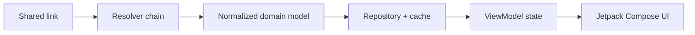

<p align="center">
  
</p>

<h1 align="center">Peek for Android</h1>

<p align="center">
  A calm, native space for the links people share.<br />
  <strong>Kotlin</strong> · <strong>Jetpack Compose</strong> · <strong>Android</strong>
</p>

Paste a link, then read, watch, and browse the content without the noise of the source app.

## Screens

<p align="center">
  
  
  
</p>
<p align="center">
  
  
  
</p>

## Current features

- Paste links from the clipboard or open Instagram and Reddit links directly.
- Resolve public Instagram posts, reels, and carousels with photos and videos.
- Resolve public Reddit posts, including text, images, galleries, Reddit-hosted video, and `/r/{sub}/s/{id}` share shortlinks.
- Read comments, load more replies, refresh content, and revisit recent links.
- Open media in an edge-to-edge viewer with video playback and carousel navigation.
- Cache resolved content locally for a quicker return experience.

## Availability

| Link type | Availability | Resolver |
| --- | --- | --- |
| Public Instagram posts (`/p/`) | Available | Direct logged-out GraphQL resolver |
| Public Instagram reels (`/reel/`, `/reels/`) | Available | Direct GraphQL resolver, then hidden WebView fallback |
| Public Instagram carousels | Available | Instagram resolver chain above |
| Public Reddit posts (`/r/{sub}/comments/{id}`, `/comments/{id}`, `/gallery/{id}`, `redd.it/{id}`, `/r/{sub}/s/{share}`) on reddit.com, www, old, np, new, and m | Available | Paste uses the in-app classifier. Logged-out JSON is tried first (`old.reddit.com`, then `www`, full permalink first). If Reddit blocks that request, a hidden WebView loads the public page logged-out and reads `shreddit-post`, embedded JSON, `__NEXT_DATA__`, or `window.__r`. Private and quarantined posts fail closed. A block is a load failure, separate from “link not supported”. Share shortlinks follow redirects, then the same path |
| Reddit subreddit feeds, profiles, search, and posts Reddit hides when logged out | Unsupported | No resolver currently available |
| Private posts, login-required content, challenges, consent flows | Unsupported | No resolver currently available |

Resolvers are selected through a shared prioritized resolver chain, so adding a new source does not require changing the viewer UI.

## Roadmap

- [x] Add Reddit public posts.
- [ ] Add more link sources, including X/Twitter, TikTok, and YouTube.
- [ ] Add more Instagram features, including Stories.
- [ ] Improve sharing, link history, and source-specific viewing experiences.

## Principle and architecture

Peek separates link resolution from presentation. Source-specific resolvers normalize content into shared domain models; repositories handle caching and pagination; ViewModels expose screen state; stateless Jetpack Compose UI renders it.



The app is a single-activity Kotlin/Jetpack Compose project. `domain` contains models, repository contracts, and use cases; `data` contains Instagram and Reddit resolution, persistence, caching, and fixtures; `ui` contains navigation, ViewModels, mappers, and rendering.

## Contributing

Peek is early and intentionally small. Ideas, source integrations, design improvements, bug reports, and pull requests are all welcome—please include a short description and relevant tests when you can.

## Build and verify

Requires JDK 17 and Android SDK 36.

```shell
./gradlew :app:assembleDebug
./gradlew :app:testDebugUnitTest :app:lintDebug
./gradlew :app:validateDebugScreenshotTest
./gradlew :app:connectedDebugAndroidTest
```

Sideload debug builds are published as `peek-reddit-debug-<versionName>.apk` (for example `peek-reddit-debug-1.0.4.apk`).

## Acknowledgements

- Peek’s Instagram fetching logic is based on [Kittygram](https://codeberg.org/irelephant/kittygram).